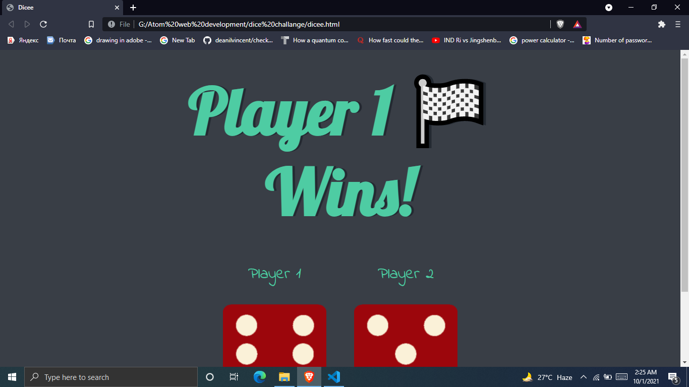
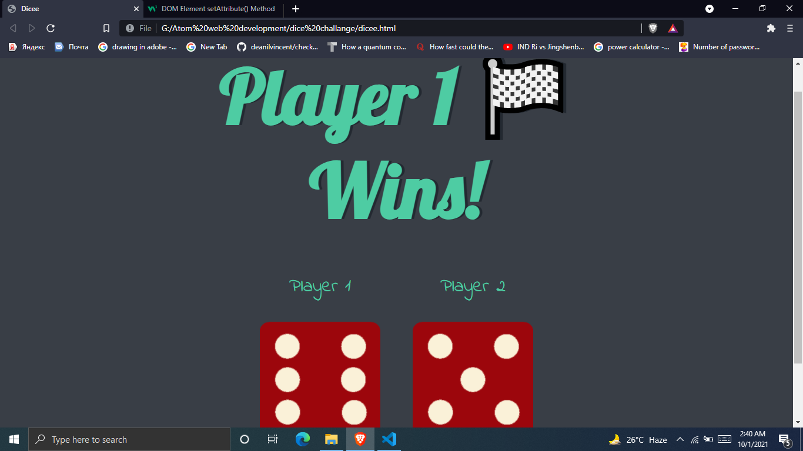
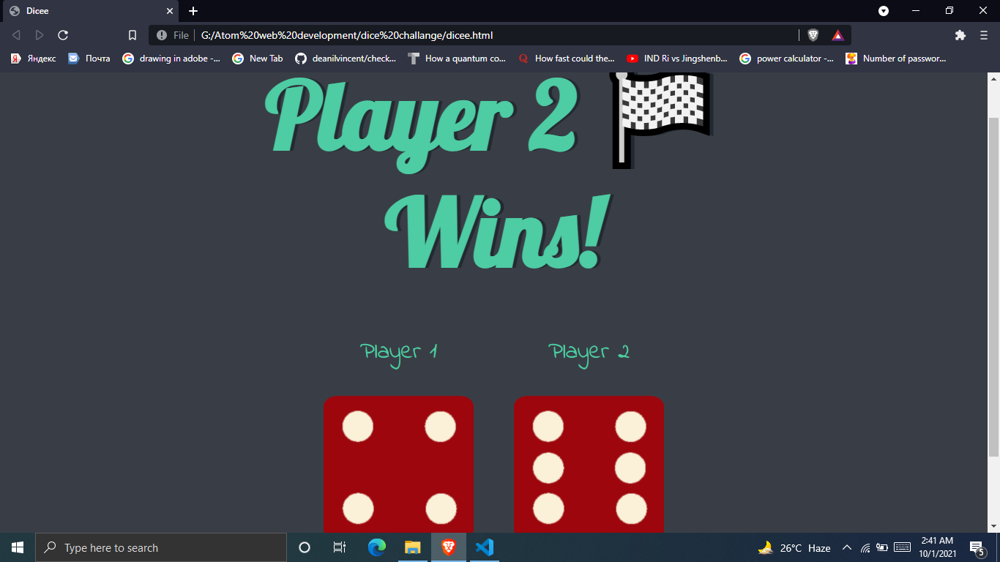
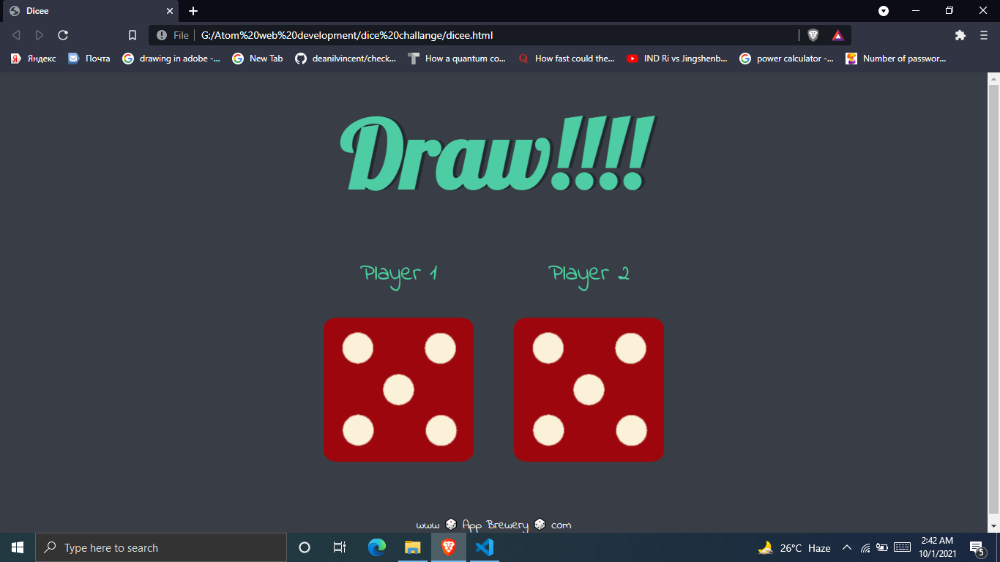

# Dice challange
## intro-section
* this webpage main motive is to make understand the javascript function with arrays and how we can play arround this array for fun

## javascript
* there are few thing which work on every reloading of this page 
* 1-math.random function call. as from the name sujest the math.random is uswd ot create random number betwenn (0-9) eg 4,8 
:-var randomNumber1=Math.floor(Math.random()*6)+1;
math.floor is to elimate decimal value. and storin this number into a variable
* 2- creating same random no 2 from second player;
var randomNumber2=Math.floor(Math.random()*6)+1;
* 3- selecting image as per random number by concatination
var randomdiceimage= "dice"+ randomNumber1 +".png";
var randomimagesource="images/"+randomdiceimage;
*4-seting the attibutes with images-The setAttribute() method adds the specified attribute to an element, and gives it the specified value.

var image1=document.querySelectorAll("img")[0];
image1.setAttribute("src", randomimagesource);

* doing same for player 2:-
var randomNumber2=Math.floor(Math.random()*6)+1;
var randomimagesource2="images/dice" + randomNumber2 +".png";

document.querySelectorAll("img")[1].setAttribute("src", randomimagesource2);
* if else conidtion to comare and declare the reault who follows the statement
if(randomNumber1>randomNumber2){
  document.querySelector("h1").innerHTML ="Player 1 🏁 Wins!";
}
else if(randomNumber2>randomNumber1){
    document.querySelector("h1").innerHTML ="Player 2 🏁Wins!";
}
else{
    document.querySelector("h1").innerHTML ="Draw!!!!";
}
* player-1 wins

* player-2 wins

* draw

